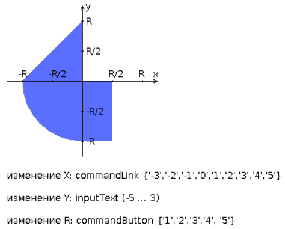

## Задание
Разработать приложение на базе JavaServer Faces Framework, которое осуществляет проверку попадания точки в заданную область на координатной плоскости.

Приложение должно включать в себя 2 facelets-шаблона - стартовую страницу и основную страницу приложения, а также набор управляемых бинов (managed beans), реализующих логику на стороне сервера.

## Стартовая страница должна содержать следующие элементы:
- [x] "Шапку", содержащую ФИО студента, номер группы и номер варианта.
- [x] Интерактивные часы, показывающие текущие дату и время, обновляющиеся раз в 12 секунд.
- [x] Ссылку, позволяющую перейти на основную страницу приложения.

## Основная страница приложения должна содержать следующие элементы:
- [x] Набор компонентов для задания координат точки и радиуса области в соответствии с вариантом задания. Может потребоваться использование дополнительных библиотек компонентов - ICEfaces (префикс "ace") и PrimeFaces (префикс "p"). Если компонент допускает ввод заведомо некорректных данных (таких, например, как буквы в координатах точки или отрицательный радиус), то приложение должно осуществлять их валидацию.
- [x] Динамически обновляемую картинку, изображающую область на координатной плоскости в соответствии с номером варианта и точки, координаты которых были заданы пользователем. Клик по картинке должен инициировать сценарий, осуществляющий определение координат новой точки и отправку их на сервер для проверки её попадания в область. Цвет точек должен зависить от факта попадания / непопадания в область. Смена радиуса также должна инициировать перерисовку картинки.
- [x] Таблицу со списком результатов предыдущих проверок.
- [x] Ссылку, позволяющую вернуться на стартовую страницу.

## Дополнительные требования к приложению:
- [x] Все результаты проверки должны сохраняться в базе данных под управлением СУБД Oracle.
- [x] Для доступа к БД необходимо использовать JPA с ORM-провайдером на усмотрение студента.
- [x] Для управления списком результатов должен использоваться Session-scoped Managed Bean.
- [x] Конфигурация управляемых бинов должна быть задана с помощью параметров в конфигурационном файле.
- [x] Правила навигации между страницами приложения должны быть заданы в отдельном конфигурационном файле.

## Вопросы к защите лабораторной работы:
1. Технология JavaServer Faces. Особенности, отличия от сервлетов и JSP, преимущества и недостатки. Структура JSF-приложения.
1. Использование JSP-страниц и Facelets-шаблонов в JSF-приложениях.
1. JSF-компоненты - особенности реализации, иерархия классов. Дополнительные библиотеки компонентов. Модель обработки событий в JSF-приложениях.
1. Конвертеры и валидаторы данных.
1. Представление страницы JSF на стороне сервера. Класс UIViewRoot.
1. Управляемые бины - назначение, способы конфигурации. Контекст управляемых бинов.
1. Конфигурация JSF-приложений. Файл faces-config.xml. Класс FacesServlet.
1. Навигация в JSF-приложениях.
1. Доступ к БД из Java-приложений. Протокол JDBC, формирование запросов, работа с драйверами СУБД.
1. Концепция ORM. Библиотеки ORM в приложениях на Java. Основные API. Интеграция ORM-провайдеров с драйверами JDBC.
1. Библиотеки ORM Hibernate и EclipseLink. Особенности, API, сходства и отличия.
1. Технология JPA. Особенности, API, интеграция с ORM-провайдерами.
